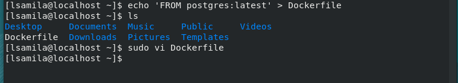
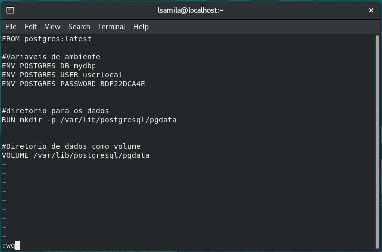
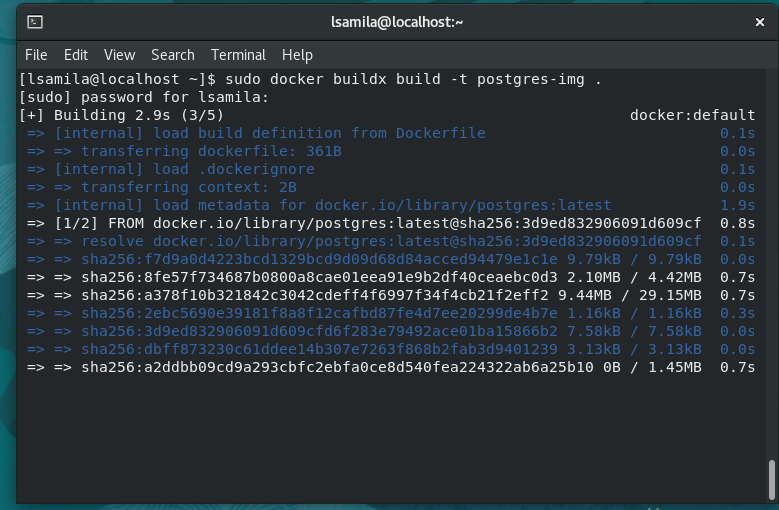
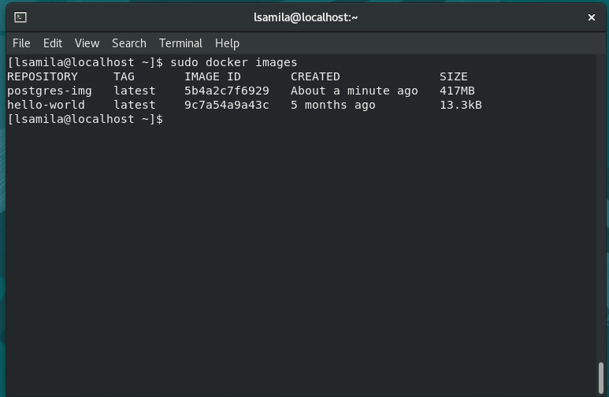
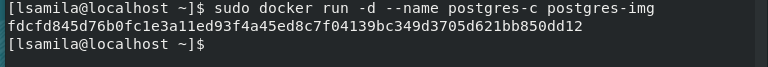
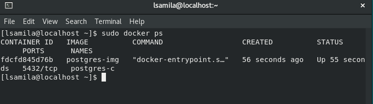
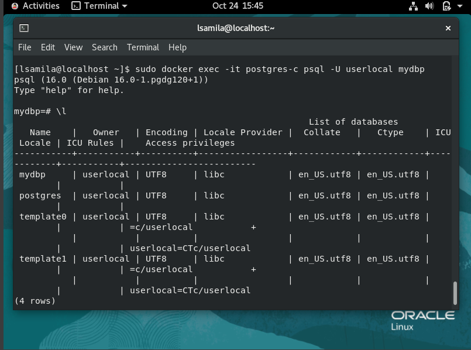

## Desafio 02 - Trilha DevSecOps na CompassUOL - Sprint 2


# Criar uma imagem do Postgresql

1. Crie um arquivo **Dockerfile**:

```
echo 'FROM postgres:latest' > Dockerfile
```

2. Edite o arquivo **Dockerfile**, :
```
sudo vi Dockerfile
```
- Dentro do arquivo **Dockerfile**:
```
# imagem oficial do PostgreSQL
FROM postgres:latest

# variáveis de ambiente
ENV POSTGRES_DB mydatabase
ENV POSTGRES_USER myuser
ENV POSTGRES_PASSWORD mypassword

# Crie um diretório para persistir os dados
RUN mkdir -p /var/lib/postgresql/pgdata

# Defina o diretório de dados como um volume
VOLUME /var/lib/postgresql/pgdata
```
* _Para Salvar o arquivo **Esc :wq**_ 



### Construir a imagem:
- Substitua **my-postgres-image** pelo o nome que você deseja
```
docker buildx build -t my-postgres-image .
```


- Verifique se a imagem foi criada usando o comando:

```
sudo docker images
```


### Execute um Container:

- Depois que criou a imagem, pode executar um container com base nela.
```
sudo docker run -d --name my-postgres-container my-postgres-image
```
**Substitua _my-postgres-container_ pelo o nome que deseja, e certifique de usar o mesmo nome que usou na imagem, _my-postgres-image_**



- Para verificar se o container foi executado:
```
sudo docker ps
```


### Acesse o PostgreSQL
```
sudo docker exec -it my-postgres-container psql -U myuser mydatabase
```

- Substitua os valores **myuser** e **mydatabase** pelos valores que você definiu nas variáveis de ambiente do **[Dockerfile](#criar-uma-imagem-do-postgresql)**. 



## Agora você tem um Container PostgreSQL em execução com os dados do banco persistidos em um volume.